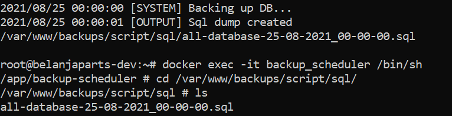

# PostgreSQL Scheduler

## Description
This is a simple scheduler that allow to automate repetitive task such as daily database scheduling.



## Usage

### Prerequisites
1. Any version of Docker.
2. Any version of Golang.
3. 'make' compiler.
4. .env file, we already provide .env.example as example.
5. Set all method at pg_hba.conf to trust

### Execute
1. Run Locally

    Running this app locally will automatically build and run this application.
    ```
        make start
    ```
2. via Docker

    Running via docker will required docker installed in your device. Authomatically create and run docker container.
    ```
        make build
    ```

### Transfer backup files

Run this following command to transfer backup files from container to host.
```
    docker cp <containerId>:/file/path/within/container /host/path/target
```